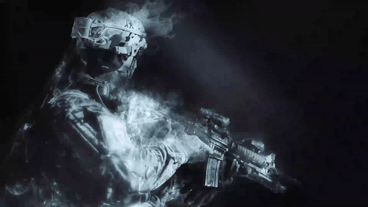
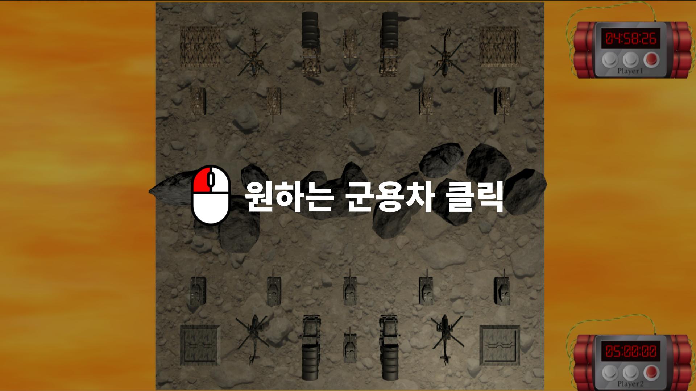
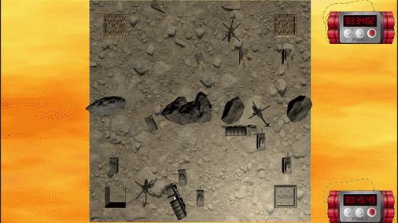
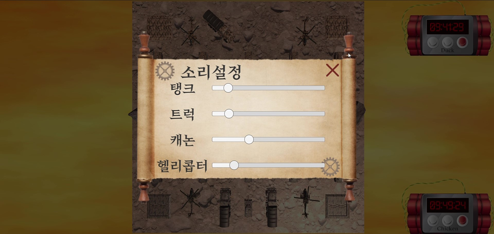
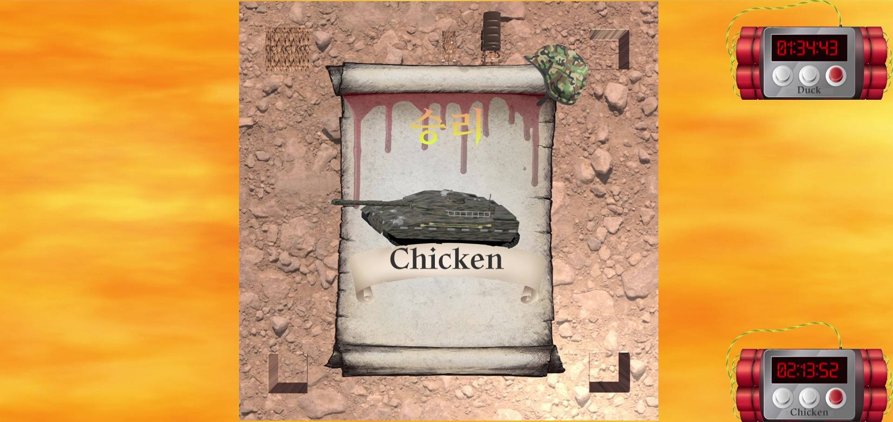

# Tank_Alkkagi

|제목|내용|
|:---:|:---:|
|기간|2022.04.14 ~ 2022.05.28|
|인원|1|
|역할|모든 작업|
|주제|각종 군용차를 사용한 전략 알까기 게임|
|특이사항|대학교 경진대회 출품작 (우수상)|

## 인트로

## 플레이
### 기본 조작법

#### 탱크
##### 연료 500만큼 이동 가능
##### 포탄 발싸시, 턴 종료

#### 두돈반
##### 증감하는 가스량을 조절하여 한 번에 날라가기
##### 두돈반이 날라갈 시, 턴 종료

#### 미사일 벙커
##### 유일하게 장애물(바위)를 부술 수 있는 미사일 발사
##### 화면 클릭시, 원하는 위치에 미사일 발사(땅이나 하늘은 불가)

#### 헬리콥터
##### 바위 위로 이동 가능
##### 총알 발사 후, 내려오는 과정에 바위에 부딪히면 파괴

## 소리 설정

## 승리조건
### 상대의 모든 군용차를 떨어뜨리면 승리!

